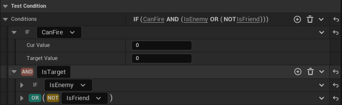
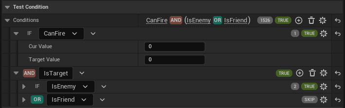
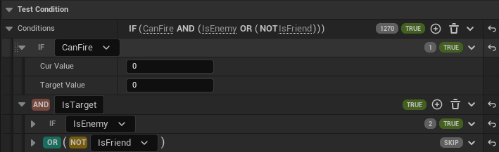
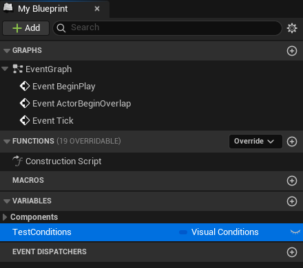
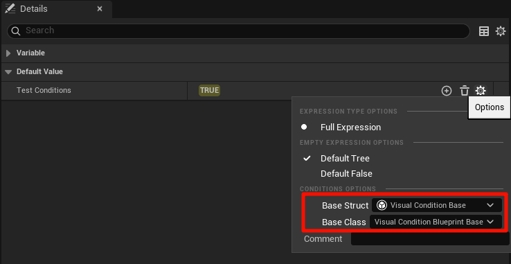
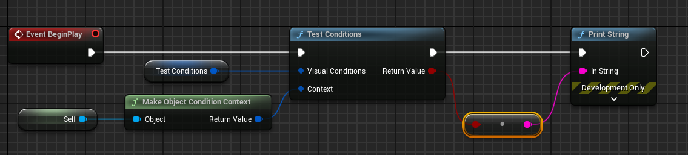
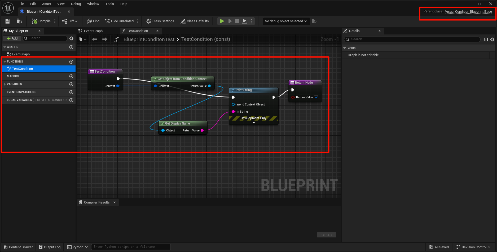

# Visual Conditions

Visual Conditions is a functional plugin that supports configuring complex conditions in the UE5 engine. It provides an excellent editor extension for configuring condition combinations and condition parameters, and has a built-in dedicated conditional expression compiler to provide optimal runtime performance. It supports displaying calculation results and visualizing conditional calculation results when running in the editor.

English | [中文](./README_ZH-CN.md)

[Requirements](#Requirements)

[Features](#Features)

[Usage](#Usage)

[Extended condition type](#Extendedconditiontype)

[Video](#Video)








## Requirements

- **Engine**：UE5.4 or higher

## Features

- Excellent editor extension support, you can configure various combinations of AND or NOT conditions to achieve configuration of any complex conditions
- Built-in dedicated compiler, support short-circuit evaluation, compile-time constant calculation and other optimizations, provide the best running performance
- Running under the editor supports displaying the calculation results and calculation order of conditions, which is convenient for observing the calculation process of conditions
- Support C++ and blueprint use
- Support C++ and blueprint unlimited expansion of custom condition types

## Usage

### C++

1. Declare a condition variable, specify BaseStruct and BaseClass for selecting configurable condition types in the editor

```cpp
	UPROPERTY(EditAnywhere, BlueprintReadWrite, Category = "Test Condition",
	    meta = (BaseStruct = "/Script/VisualConditions.VisualConditionBase", BaseClass = "/Script/VisualConditions.VisualConditionBlueprintBase"))
	FVisualConditions Conditions;
```

2. To perform conditional calculations, you need to construct an execution context first and pass it to the conditional variable for result calculation. Here, the built-in UObject execution context is used. You can customize the execution context as needed.

```cpp
    // Build Context
	FConditionExecutionContext Context(MakeShareable(new FConditionContextPayload_Object(this)));
    // Test Conditions
	bool bConditionResult = Conditions.TestConditions(Context);
```

### Blueprint
 
1. Declare a condition variable

    

2. Specifying BaseStruct and BaseClass

    

3. Performing conditional calculations

    

## Extended condition type

### C++

Inherit FVisualConditionBase, override and implement the TestCondition function.

```cpp
USTRUCT(DisplayName = "Integer Compare")
struct FTestCondition_IntegerCompare : public FVisualConditionBase
{
	GENERATED_BODY()

	UPROPERTY(EditAnywhere, Category = "VisualConditions")
	int32 CurValue;

	UPROPERTY(EditAnywhere, Category = "VisualConditions")
	int32 TargetValue;
	
public:
	/** @return True if the condition passes. */
	virtual bool TestCondition(const FConditionExecutionContext& Context) const override
	{
		return CurValue == TargetValue;
	}
};

USTRUCT(DisplayName = "Bool Compare", Category="Condition|Test")
struct FTestCondition_BoolCompare : public FVisualConditionBase
{
	GENERATED_BODY()

	UPROPERTY(EditAnywhere, Category = "VisualConditions")
	double ParamDoubleValue;
	
	UPROPERTY(EditAnywhere, Category = "VisualConditions")
	float ParamFloatValue;
	
	UPROPERTY(EditAnywhere, Category = "VisualConditions")
	bool bResult;

public:
	/** @return True if the condition passes. */
	virtual bool TestCondition(const FConditionExecutionContext& Context) const override
	{
		return bResult;
	}
};
```
### Bluprint
 
Inherit UVisualConditionBlueprintBase, override and implement the TestCondition function.

   

## Video

[YouTube](https://youtu.be/TkRC0jF7YJY)

[Bilibili](https://www.bilibili.com/video/BV1MTmhY4Etj/?spm_id_from=333.999.0.0&vd_source=3376b8faa7bb6463cc274d54cd404c0d)
