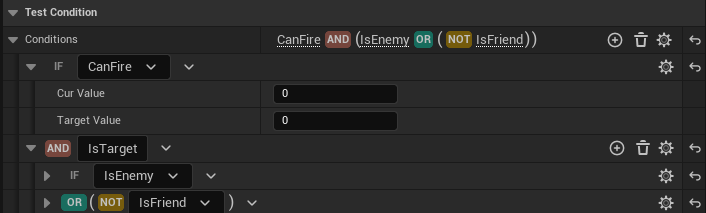
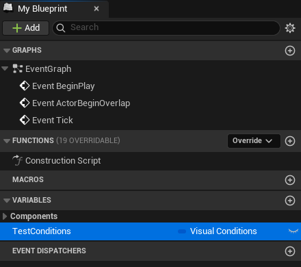
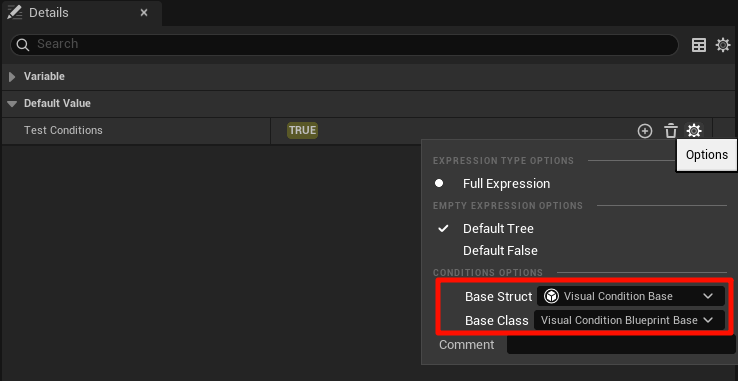

# Visual Conditions

Visual Conditions是一个支持在UE5引擎中配置复杂条件的功能插件，它提供了优异的编辑器扩展用于配置条件组合和条件参数，内置了专用的条件表达式编译器，用于提供最佳运行时性能，编辑器下运行支持展示计算结果，可视化条件计算结果。

[English](./README.md) | 中文

[安装要求](#安装要求)

[特性](#特性)

[基础使用](#基础使用)

[扩展条件类型](#扩展条件类型)

[视频](#视频)




# 安装要求

- **引擎**：UE5.4或更高版本

# 特性

- 优异的编辑器扩展支持，可以配置各种与或非条件的组合嵌套，实现任意复杂条件的配置
- 内置专用编译器，支持短路求值，编译期常量计算等优化，提供最佳运行性能
- 编辑器下运行支持展示条件的计算结果，计算顺序等，便于观察条件的计算过程
- 支持C++和蓝图使用
- 支持C++和蓝图无限扩展自定义条件类型

# 基础使用

## C++

1. 声明一个条件变量，指定BaseStruct和BaseClass用于编辑器下选择可配置的条件类型

```cpp
	UPROPERTY(EditAnywhere, BlueprintReadWrite, Category = "Test Condition",
	    meta = (BaseStruct = "/Script/VisualConditions.VisualConditionBase", BaseClass = "/Script/VisualConditions.VisualConditionBlueprintBase"))
	FVisualConditions Conditions;
```

2. 执行条件计算, 需要先构造一个执行上下文，传递给条件变量进行结果计算，这里使用了内置的UObject执行上下文，可以根据需要自定义执行上下文

```cpp
    // Build Context
	FConditionExecutionContext Context(MakeShareable(new FConditionContextPayload_Object(this)));
    // Test Conditions
	bool bConditionResult = Conditions.TestConditions(Context);
```

## 蓝图
 
1. 声明一个条件变量

    

2. 指定BaseStruct和BaseClass

    

3. 执行条件计算

    

# 扩展条件类型

## C++

继承FVisualConditionBase，重载实现TestCondition函数

```cpp
USTRUCT(DisplayName = "Integer Compare")
struct FTestCondition_IntegerCompare : public FVisualConditionBase
{
	GENERATED_BODY()

	UPROPERTY(EditAnywhere, Category = "VisualConditions")
	int32 CurValue;

	UPROPERTY(EditAnywhere, Category = "VisualConditions")
	int32 TargetValue;
	
public:
	/** @return True if the condition passes. */
	virtual bool TestCondition(const FConditionExecutionContext& Context) const override
	{
		return CurValue == TargetValue;
	}
};

USTRUCT(DisplayName = "Bool Compare", Category="Condition|Test")
struct FTestCondition_BoolCompare : public FVisualConditionBase
{
	GENERATED_BODY()

	UPROPERTY(EditAnywhere, Category = "VisualConditions")
	double ParamDoubleValue;
	
	UPROPERTY(EditAnywhere, Category = "VisualConditions")
	float ParamFloatValue;
	
	UPROPERTY(EditAnywhere, Category = "VisualConditions")
	bool bResult;

public:
	/** @return True if the condition passes. */
	virtual bool TestCondition(const FConditionExecutionContext& Context) const override
	{
		return bResult;
	}
};
```
## 蓝图
 
继承蓝图基类UVisualConditionBlueprintBase, 重载实现TestCondition函数

   

# 视频

[YouTube](https://youtu.be/TkRC0jF7YJY)

[Bilibili](https://www.bilibili.com/video/BV1MTmhY4Etj/?spm_id_from=333.999.0.0&vd_source=3376b8faa7bb6463cc274d54cd404c0d)
